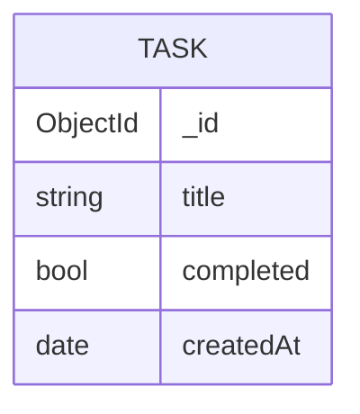

# EDD.md

## Overview

This EDD documents the MongoDB data model for the Next.js + MongoDB starter template.

- Client source of truth: `lib/mongodb.ts`
- Data access source of truth: `db/connection-status.ts`
- Application name (connection metadata): `devrel-github-javascript-nextjs`

This template is intentionally minimal: it ships **without any application-specific
collections**. The only database interaction is a connectivity health check that runs a
`ping` admin command to confirm the app can reach MongoDB. The result drives the status
badge rendered on the home page (`app/page.tsx`).

## Entities

_No application collections are defined yet._

The template performs a single read-only operation:

| Operation | Command | Database | Purpose |
| --- | --- | --- | --- |
| Connection health check | `db.command({ ping: 1 })` | Default database from `MONGODB_URI` | Verify connectivity for the status badge on `/` |

## Adding Your First Entity

When you introduce a collection, document it here using the standard EDD format so agents
have a reliable schema contract. For example:

### Example: Task

Collection: `tasks`

| Field | BSON Type | Required | Constraints | Description |
| --- | --- | --- | --- | --- |
| `_id` | `ObjectId` | No | Generated by MongoDB | Primary key |
| `title` | `string` | Yes | `minLength: 1` | Task title |
| `completed` | `bool` | Yes | Defaults to `false` | Completion state |
| `createdAt` | `date` | Yes | Set on insert | Creation timestamp |

## Mermaid Diagram

